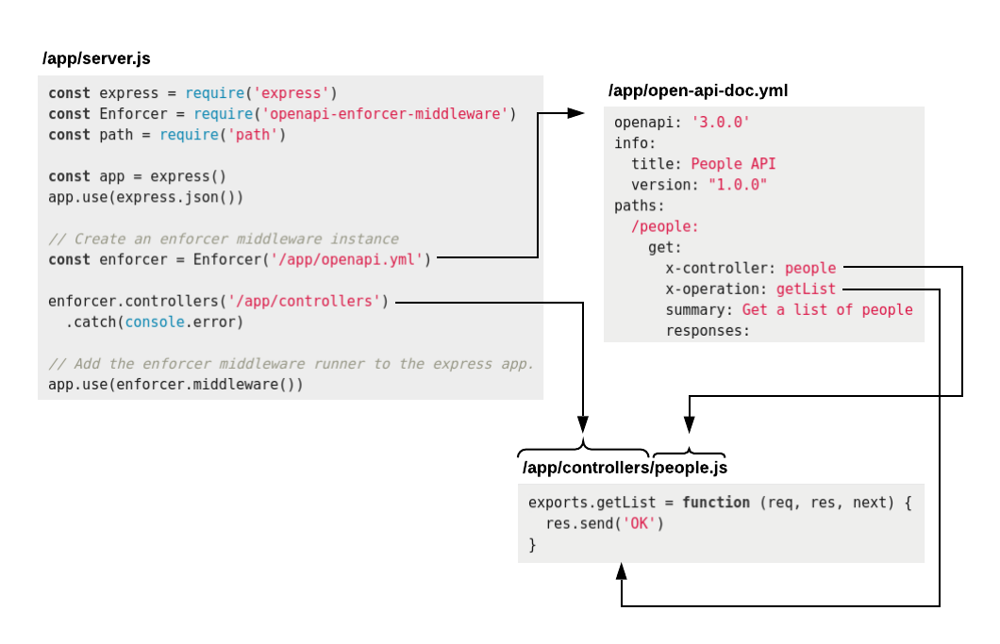

# Defining Controllers

A controller is an object whose properties are functions. These functions will be called by the OpenAPI Enforcer Middleware according to the `x-controller` and `x-operation` attributes you [specify in your OpenAPI document](openapi-document.md). When these functions are called, they will receive the request, response, and next function as parameters.

You can define your controller objects one of two ways:
 
1. As an `object`.

2. As a `function` that returns an object.

## Controller via an Object

Define the object, naming the properties the same as those listed as the `x-operation` properties in your [OpenAPI document](openapi-document.md).

```js
module.exports = {
  addPerson: async function (req, res, next) {
    await savePersonToDatabase(req.body)
    res.sendStatus(201)
  },
  
  getPerson: async function (req, res, next) {
    const person = await getPersonById(req.params.personId)
    if (person) {
      res.send(person)
    } else {
      res.sendStatus(404)
    }
  }
}
```

## Controller via a Function

When creating a controller via a function, the function must return an object that looks like a controller object. The advantage of this method is that it allows for [dependency injection](#dependency-injection).

```js
module.exports = function () {
  return {
    addPerson: async function (req, res, next) {
      await savePersonToDatabase(req.body)
      res.sendStatus(201)
    },
      
    getPerson: async function (req, res, next) {
      const person = await getPersonById(req.params.personId)
      if (person) {
        res.send(person)
      } else {
        res.sendStatus(404)
      }
    }
  }
}
```

## Dependency Injection

Dependency injection is when you pass dependencies (database connections, data, functionality, etc.) into a function so that it can use the dependencies to accomplish its task.

For example, if you have a controller that requires a connection to the database to operate, you may want to pass that dependency in. This improves the testability of your code.

Accomplishing dependency injection with the OpenAPI Enforcer middleware is a two step process:

1. Define a controller via a function and add parameters to the function signature:

    ```js
    module.exports = function (databaseConnection, someData) {
      const controller = {}
    
      controller.addPerson = async function (req, res, next) {
        const { id, name } = req.body
        const rows = await databaseConnection.query('INSERT INTO people (id, name) VALUES ($1, $2)', [ id, name ])
        res.send(rows)
      }
    
      return controller
    }
    ```
    
2. When telling the OpenAPI Enforcer Middleware where to find the controller, also specify the parameters to pass in:

    ```js
    const EnforcerMiddleware = require('openapi-enforcer-middleware')
    const express = require('express')
    
    const app = express()
    const enforcer = EnforcerMiddleware('/path/to/openapi-definition.yml')
    const databaseConnection = getDatabaseConnection()
    const someData = { ... }

    // pass in dependencies
    enforcer.controllers('/path/to/controllers-dir', databaseConnection, someData)
    
    app.use(enforcer.middleware())
    
    app.listen(3000)
    ```

# Referencing Controllers

You know [how to define a controller](#defining-controllers). Here we cover how you can set up the OpenAPI Enforcer middleware can call it.

## Controllers in Files

Placing each unique controller in its own file is the recommended method. It simplifies code and makes it easily testable.



1. Choose a directory where you'll put your controller files.

2. Create files with the same names as the `x-controller` property in your [OpenAPI document](openapi-document.md).

    For example, you will need a file named `people.js` if you have an OpenAPI document with an `x-controller` set to `people`
    
    ```yml
    paths:
      /people:
        get:
          x-controller: people
          x-operation: getList
          ...
    ```
    
3. Export your controller object or function from each file, defining the properties that match the operations. 

    **people.js**
    
    ```js
    exports.getList = async function (req, res, next) {
      const list = await getAllPeople()
      res.send(list)
    }
    ```

## Inline Controllers

Inline controllers are defined as an object whose properties are the `x-controller` names and its values are a controller object. Below is a section of an OpenAPI document and a section of how you would set up your server to use inline controllers.

**OpenAPI Document**

```yml
paths:
  /people/{id}:
    get:
      x-controller: people
      x-operation: getPerson
      ...
```

**Server File**

```js
// Create a controllers map
const controllersMap = {
  people: { // associates to x-controller: people
    
    // associates to x-operation: getPerson
    getPerson: async function (req, res, next) {
      const person = await getPersonById(req.params.id)
      if (person) {
        res.send(person)
      } else {
        res.sendStatus(404)
      }
    }
  }
}

// Add controllers
enforcer.controllers(controllersMap)
  .catch(console.error)

// Add the enforcer middleware runner to the express app.
app.use(enforcer.middleware())
```
